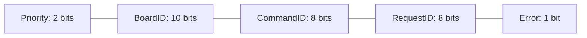

# Using CAN on the 1.x Devkit

## Preface
CAN (Controller Area Network) is a protocol for communication over medium distances. Physically, the bus runs over a differential twisted pair, CAN H and CAN L.
The way an STM32 connects to a CAN bus is via a CAN transceiver. The transceiver converts the digital signals from the STM32 CAN_TX and CAN_RX pins to CAN H and CAN L.

An actual CAN message is made of two parts, the identifier and the data field. The data field can be between 0-64 bytes.

We use extended identifiers (29-bit) for CAN messages. Our 29 bit identifiers are structured like so:

Each device gets a unique board ID, and when it is send a can message, it will ONLY process messages with its own board ID. This is done in hardware filtering, so the STM32 does not need to filter messages at runtime.

Any identifier from 0x100 to 0x3FF is fair game for board IDs. We use the board IDs from 0x0FF-0x0FF, so please do not use these.

Other than that, please see the examples in the scripts and firmware repositories for formatting, processing, and parsing can messages.
