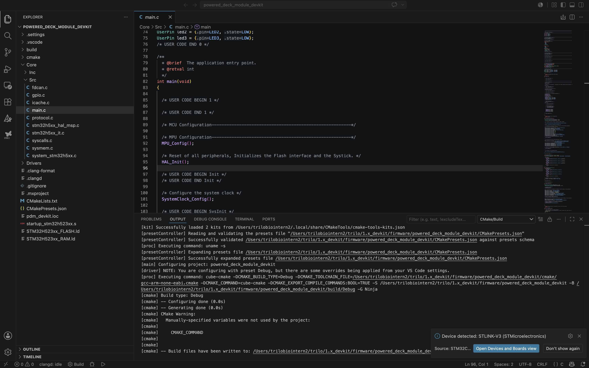
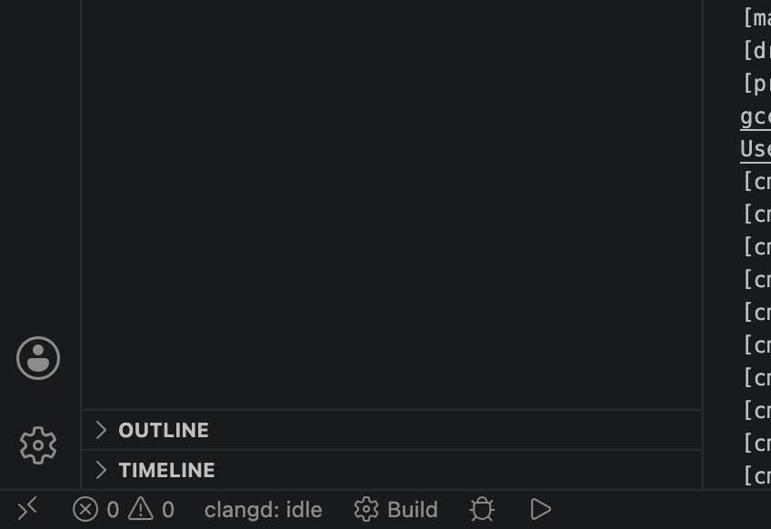
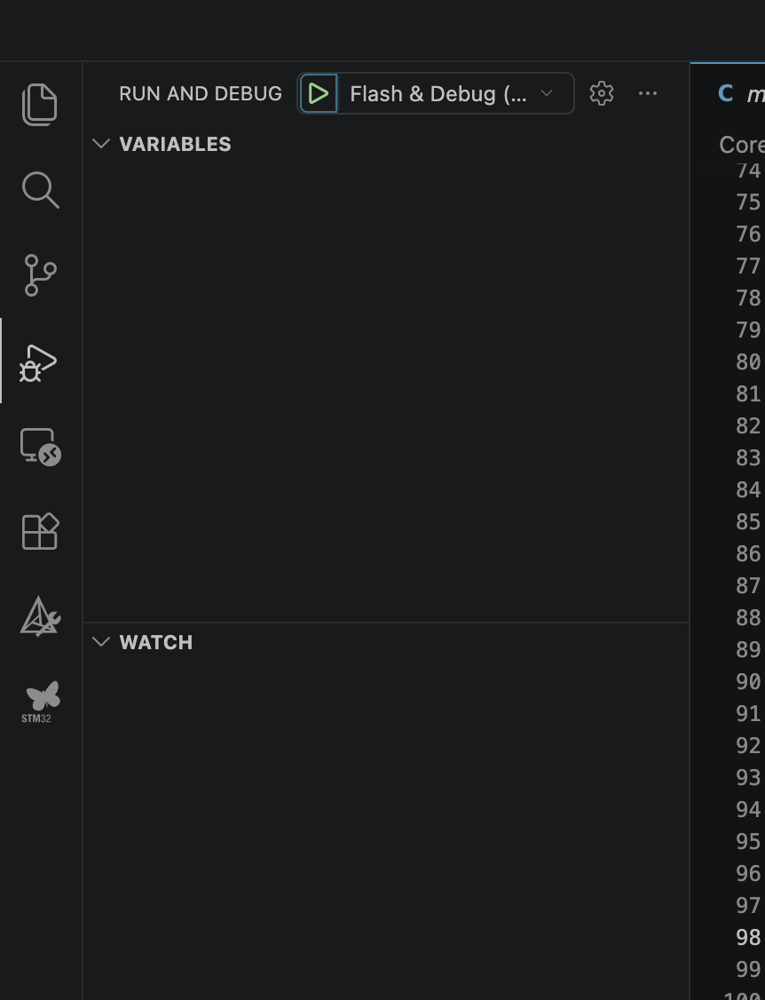

# Trilobio 1.x Developer Kit

## Repo Structure
```
1.x_devkit
├── firmware
│   ├── powered_deck_module_devkit # Firmware for the powered deck module 
│   ├── powered_deck_slot_devkit # Firmware for the powered deck slot devkit
│   └── tool_devkit # Firmware for the tool devkit (probably wont need this)
├── Justfile
├── raspi
│   ├── cansender
│   ├── initialization
│   └── scripts # Python scripts for the Raspberry Pi showing CAN interactions
├── README.md
└── schematics
    ├── powered_deck_module_devkit.pdf 
    └── tool_devkit.pdf
```
## Needed Software:
- VS Code
  - STM32 Cube extention
- STM32Cube MX
**For mac:**
```sh
brew install cmake ninja
```
**For linux: (ubuntu)**
```sh
sudo apt install cmake ninja-build gcc-arm-none-eabi libnewlib-arm-none-eabi libstdc++-arm-none-eabi-newlib
```

### Install STM32CubeCLT

Download and install [STM32CubeCLT](https://www.st.com/en/development-tools/stm32cubeclt.html) from ST's website. This provides the ST-Link GDB server and STM32CubeProgrammer, both required for flashing and debugging.

> [!NOTE]
> You will need to create a free ST account to download.

### Install VS Code Extensions

Open VS Code and install the following extensions (`Cmd+Shift+X` on macOS, `Ctrl+Shift+X` on Ubuntu/Windows):

| Extension | ID | Purpose |
|-----------|----|---------|
| **C/C++ Extension Pack** | `ms-vscode.cpptools-extension-pack` | C/C++ language support, IntelliSense |
| **CMake Tools** | `ms-vscode.cmake-tools` | CMake integration (configure, build, preset selection) |
| **STM32 VS Code Extension** | `stmicroelectronics.stm32-vscode-extension` | ST-Link debugging, flashing, SVD register views, live watch, clangd-based IntelliSense and formatting |

The STM32 extension will automatically install its required companion extensions (debug core, build tools, bundles manager, clangd, etc.).

You can also install them from the command line:

```bash
code --install-extension ms-vscode.cpptools-extension-pack
code --install-extension ms-vscode.cmake-tools
code --install-extension stmicroelectronics.stm32-vscode-extension
```

### Install STM32CubeMX

Download and install [STM32CubeMX](https://www.st.com/en/development-tools/stm32cubemx.html) from ST's website.

> [!NOTE]
> You will need a free ST account to download.

Once in CubeMX, open any .ioc file to configure your STM32 project further. Make sure to click "Generate Code" to generate the project files.


## Development
If you open one of the firmware directories in VS Code, you will be prompted to configure the CMake project.
After configuring, you can build and debug with cmake or using the buttons in VsCode like shown:








To use flash and debug, you must have the stling connected to your computer and also connected to the target STM32 board using the tagConnect cable.
> [!NOTE]
> The Tool devkit and Powered Deck module use the special tag connect cable with the swapped SWCLK and SWDIO wires. The deck slot board uses a normal cable.


## Setup on a fresh Raspberry Pi:
```sh
git clone https://github.com/trilobio/1.x_devkit.git
cd 1.x_devkit
# In repo root
sudo apt-install just
just initialize
sudo reboot
```

After reboot:
```sh
cd 1.x_devkit
just check-can
```
